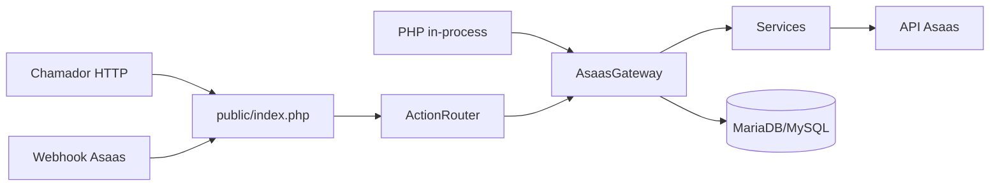

# Asaas Biblioteca

Camada de integração PHP com a API da Asaas: contrato estável para cobranças, assinaturas, clientes, NFS-e e webhooks. Use no mesmo processo com `AsaasGateway` ou expor um endpoint HTTP único com autenticação interna.

## Por que usar

- Um contrato único para PIX, boleto, link de cartão, assinatura e nota fiscal.
- Duas formas de consumo: PHP in-process ou HTTP JSON com HMAC.
- Defaults de negócio por ação em `config/*.php`, sobrescritos no payload de cada chamada.
- Webhook com token, idempotência por `eventId` e trilha de auditoria em banco.
- Ambiente `auto`, `sandbox` ou `production` com detecção por host.

## Recursos

| Área | Capacidades |
|------|-------------|
| Pagamentos | PIX, boleto, link de cartão, status, QR Code, atualização, estorno, cancelamento |
| Assinaturas | Criação, cobranças da assinatura, atualização, cancelamento |
| Clientes | CRUD, listagem por período ou ID, resolução automática na emissão |
| NFS-e | Agendar, emitir, consultar, listar e cancelar |
| Webhook | Recepção segura, deduplicação, eventos `log_only`, mapeamento para status internos |
| Plataforma | Config por env/arquivo, debug seguro, API interna desligável, testes de contrato |

## Arquitetura



## Requisitos

- PHP 8.0+
- Extensões: `curl`, `pdo_mysql` (auditoria e idempotência do webhook)
- Conta Asaas (sandbox ou produção)
- MariaDB/MySQL para `asaas_event_log` e `asaas_fila_processamento`

## Início rápido

### 1. Configuração

```bash
cp config/options_example.php config/options.php
```

Edite `config/options.php` com hosts, chaves Asaas, banco e segredos da API interna. O arquivo `config/options.php` não deve ser versionado; use o exemplo como base.

Ajuste defaults de negócio nos arquivos `config/create_payment_*.php`, `config/create_subscription.php`, `config/issue_invoice.php` e demais features conforme o produto.

### 2. Banco de dados

Execute os scripts em `sql/`:

- `sql/asaas_event_log.sql`
- `sql/asaas_fila_processamento.sql`

Os scripts usam `utf8mb4`. Instalações antigas podem exigir `ALTER TABLE` para alinhar o charset.

### 3. Uso in-process (recomendado no mesmo servidor)

```php
<?php

require_once __DIR__ . '/src/bootstrap.php';

use AsaasBiblioteca\AsaasGateway;

$gateway = new AsaasGateway([
    'api_key' => getenv('ASAAS_API_KEY'),
    'environment' => 'sandbox',
]);

$result = $gateway->createPixCharge([
    'customer' => 'cus_000000000000',
    'value' => 99.90,
    'dueDate' => date('Y-m-d'),
    'description' => 'Cobrança de teste',
]);

if (empty($result['success'])) {
    throw new RuntimeException((string) ($result['message'] ?? 'Falha na cobrança.'));
}
```

### 4. Uso via HTTP

Publique `public/index.php` e envie `POST` JSON com `action`. Chamadas internas exigem `X-Internal-Token`, `X-Timestamp` e `X-Signature` (HMAC-SHA256 de `timestamp + "." + rawBody`).

```bash
curl -X POST "https://seu-dominio/asaas-biblioteca/public/index.php" \
  -H "Content-Type: application/json" \
  -H "X-Internal-Token: SEU_TOKEN" \
  -H "X-Timestamp: $(date +%s)" \
  -H "X-Signature: ASSINATURA_HMAC" \
  -d '{
    "action": "create_payment",
    "paymentMethod": "pix",
    "customer": "cus_000000000000",
    "value": 99.9,
    "dueDate": "2026-05-10",
    "description": "Cobrança de teste"
  }'
```

Defina `internal.http_api_enabled = false` (ou `ASAAS_INTERNAL_HTTP_API_ENABLED=false`) para desligar ações internas via HTTP e manter apenas o webhook no endpoint público.

Detalhes de autenticação, mapeamento action → método e exemplos adicionais: [`docs/USO_CHAMADAS.md`](docs/USO_CHAMADAS.md).

## API — ações disponíveis

Todas as ações usam JSON com campo `action` (exceto webhook sem `action`, tratado como `webhook_receive`).

| Grupo | `action` | Documentação |
|-------|----------|--------------|
| Pagamento | `create_payment` | [PIX](docs/create_payment_pix.md) · [Boleto](docs/create_payment_billet.md) · [Cartão](docs/create_payment_card_link.md) |
| Pagamento | `get_payment_status`, `get_pix_qrcode`, `update_payment`, `refund_payment`, `cancel_payment` | [Status](docs/get_payment_status.md) · [QR Code](docs/get_pix_qrcode.md) · [Atualizar](docs/update_payment.md) · [Estorno](docs/refund_payment.md) · [Cancelar](docs/cancel_payment.md) |
| Assinatura | `create_subscription`, `get_subscription_payments`, `update_subscription`, `cancel_subscription` | [Criar](docs/create_subscription.md) · [Cobranças](docs/get_subscription_payments.md) · [Atualizar](docs/update_subscription.md) · [Cancelar](docs/cancel_subscription.md) |
| Cliente | `create_customer`, `get_customer`, `list_customers`, `update_customer`, `delete_customer` | [Índice de clientes](docs/ACOES_INDICE.md) |
| NFS-e | `issue_invoice`, `get_invoice`, `list_invoices`, `cancel_invoice` | [Emitir](docs/issue_invoice.md) · [Consultar](docs/get_invoice.md) · [Listar](docs/list_invoices.md) · [Cancelar](docs/cancel_invoice.md) |
| Webhook | `webhook_receive` | [Webhook](docs/webhook_receive.md) |

Índice completo: [`docs/ACOES_INDICE.md`](docs/ACOES_INDICE.md).

### Validação de contrato (HTTP)

O `ActionRouter` valida IDs obrigatórios antes de chamar a Asaas. Ausência ou `paymentMethod` inválido retorna HTTP `400` com `errorCode = validationError`. Em `create_payment`, os métodos aceitos são `pix`, `boleto` e `cartao`.

### Resposta padrão

```json
{
  "success": true,
  "message": "Mensagem legível",
  "data": {},
  "errorCode": "validationError"
}
```

`errorCode` aparece em falhas. No HTTP, detalhes da Asaas só são expostos com `debug.enabled` e `debug.safe_details` ativos.

## Configuração

### Ambiente

Em `config/options.php`:

- `environment: auto` — sandbox ou produção conforme `prod_hosts` e `dev_hosts`
- `environment: sandbox` ou `production` — ambiente fixo

Com `auto`, host não listado cai em sandbox e gera aviso em log. Revise as listas antes de produção.

### Infraestrutura vs regras por ação

| Tipo | Onde |
|------|------|
| Infraestrutura | `config/options.php` — API, webhook, banco, debug, API interna |
| Negócio por ação | `config/*.php` — vencimento, multas, parcelas, NFS-e, listagens, HTTP defaults |

Na chamada, campos do payload sobrescrevem os defaults do arquivo da ação.

### Precedência de configuração

1. Array injetado no `AsaasGateway`
2. Variáveis de ambiente (`ASAAS_API_KEY`, `ASAAS_ENV`, `ASAAS_WEBHOOK_TOKEN`, `ASAAS_DEBUG`, `ASAAS_INTERNAL_HTTP_API_ENABLED`, entre outras)
3. `config/options.php`
4. Fallback em código

| Chave | Array gateway | Env | `options.php` |
|-------|---------------|-----|---------------|
| Ambiente | `environment` | `ASAAS_ENV` | `environment` |
| API key | `api_key` | `ASAAS_API_KEY` | `api.api_key_*` |
| Base URL | `api_base_url` | `ASAAS_API_BASE_URL` | `api.base_url_*` |
| Webhook | `webhook_token` | `ASAAS_WEBHOOK_TOKEN` | `webhook.token_*` |
| API interna | `internal_http_api_enabled` | `ASAAS_INTERNAL_HTTP_API_ENABLED` | `internal.http_api_enabled` |
| Debug | `debug_enabled` | `ASAAS_DEBUG` | `debug.enabled` |
| Defaults NFS-e / ações | `invoice_defaults`, `{feature}_defaults` | — | `config/{acao}.php` |

## Segurança

**API interna (HTTP):** token fixo, timestamp com janela de validade e assinatura HMAC do body; allowlist de IP opcional.

**Webhook:** validação por token no header configurável; filtro de IP opcional (`webhook.ip_filter_enabled`). Idempotência por `eventId` na fila `asaas_fila_processamento`.

**Boas práticas:** não versionar `config/options.php`; preferir variáveis de ambiente em produção; desligar a API HTTP interna se o consumo for só in-process; manter `debug.enabled` desligado fora de homologação.

## Webhook e auditoria

Sem `action` no body, o endpoint assume `webhook_receive`. Eventos financeiros mapeiam para status internos (`Pago`, `Pendente`, `Vencido`, `Cancelado`); eventos informativos seguem política `log_only`.

Reentregas com o mesmo `eventId` respondem HTTP `200` sem reprocessar. Falhas de persistência em auditoria não derrubam a resposta do webhook quando a decisão de negócio já foi tomada.

Eventos e metadados ficam em `asaas_event_log`. Ver [`docs/webhook_receive.md`](docs/webhook_receive.md).

## Comportamentos úteis

**Cliente na emissão:** envie `customer` (`cus_...`) ou `customerData` para buscar, criar ou atualizar antes de cobrar. Ver [`docs/cliente_resolucao_automatica.md`](docs/cliente_resolucao_automatica.md).

**Cupom:** `couponType`, `couponValue` e `couponDueDateLimitDays` convertem para `discount` da Asaas; também é aceito `discount` no formato da API.

**NFS-e:** defaults em `config/issue_invoice.php`; `issueNow` controla agendar vs emitir na sequência.

## Testes

```bash
php tests/contract_test.php
php tests/security_test.php
```

Checklist manual (sandbox e produção): [`TESTES_BIBLIOTECA.md`](TESTES_BIBLIOTECA.md).

## Estrutura do projeto

```
asaas-biblioteca/
├── config/           # options, helpers e defaults por ação
├── docs/             # referência por action
├── public/           # index.php (HTTP + webhook)
├── sql/              # auditoria e idempotência
├── src/
│   ├── AsaasGateway.php
│   ├── Config/
│   ├── Http/
│   ├── Services/
│   ├── Security/
│   ├── Audit/
│   └── Infrastructure/
└── tests/
```

## Cliente HTTP

`AsaasHttpClient` usa `GET`, `POST` e `DELETE` contra a API v3 da Asaas. Timeout e retentativas vêm de `api.timeout_seconds` e `api.retry_attempts` em `config/options.php`.

## Documentação

- [`docs/USO_CHAMADAS.md`](docs/USO_CHAMADAS.md) — HTTP vs in-process, ambiente, erros e validação
- [`docs/ACOES_INDICE.md`](docs/ACOES_INDICE.md) — índice de todas as ações
- [`TESTES_BIBLIOTECA.md`](TESTES_BIBLIOTECA.md) — plano de testes e smoke

## Licença

Defina a licença do repositório (por exemplo MIT ou uso interno) conforme a política do seu projeto.
